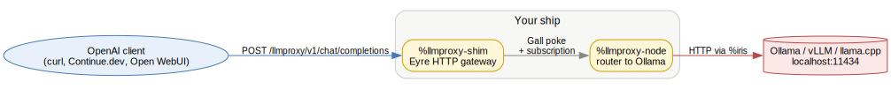
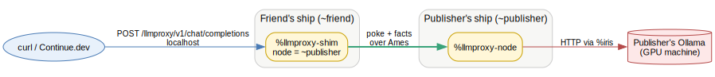

# %llmproxy

An Urbit desk that turns any ship into an OpenAI-compatible LLM proxy. A node operator with a GPU exposes a local inference server (Ollama, vLLM, llama.cpp, anything that speaks OpenAI's `/v1/chat/completions`) to friends over Ames. Friends install the desk on their own ship, point any OpenAI tool at `http://localhost:<port>/llmproxy`, and their requests transparently traverse Urbit to the node's hardware.

Status: v0.4 — works end-to-end between two ships. See *Known limitations* below for what's honest about it. Full design spec in [`SPEC.md`](./SPEC.md).

## You'll need

- An Urbit ship. A free comet works fine — see [hawk.computer/install](https://hawk.computer/~~/install/).
- The `urbit` binary running. The ship's HTTP port (typically `:80` or whatever Eyre bound — check `<pier>/.http.ports`).
- *(Node operator only)* a local OpenAI-compatible inference server. Ollama at `localhost:11434` is the default assumption; other servers work as long as they expose `/v1/chat/completions`.

## Install (as the publisher)

You're the one with the GPU. From your ship's dojo:

```
|merge %llmproxy our %base
|mount %llmproxy
```

That mounts a forked-from-base desk at `<pier>/llmproxy/`. Now copy this repo's desk source onto it:

```bash
# from this repo's root, on the same machine as your pier
cp -R desk/* <pier>/llmproxy/
```

`desk.bill` overwrites base's bill so only our 3 agents auto-start. The `sur/`, `mar/`, `app/` files add new content alongside base's.

Back in the dojo:

```
|commit %llmproxy
|public %llmproxy
|install our %llmproxy
```

`|public` makes the desk pullable by anyone you give your `@p` to. `|install our %llmproxy` boots the agents on your ship. You should see:

```
gall: booted %llmproxy-node
gall: booted %llmproxy-client
gall: booted %llmproxy-shim
```

The shim binds at `http://<your-ship-host>/llmproxy`. By default it points at `our.bowl` (your own ship's node). To use a different ship's node:

```
:llmproxy-shim &noun [%set-node ~some-other-ship]
```

To advertise the actual models your Ollama has:

```
:llmproxy-shim &noun [%set-models ~['llama3.1:8b' 'mistral:7b']]
```

## Install (as a friend)

You want to use someone else's GPU. Get their `@p` and:

```
|install ~publisher-ship %llmproxy
```

This pulls the desk over Ames. ~30-60 seconds (the desk is base + our additions, ~15 MB). When you see all three agents `booted`, configure your shim to send jobs to the publisher's node:

```
:llmproxy-shim &noun [%set-node ~publisher-ship]
:llmproxy-shim &noun [%set-models ~['llama3.1:8b']]
```

That's it. Your ship is now an OpenAI endpoint at `http://localhost:<your-http-port>/llmproxy` whose requests proxy to the publisher.

## Usage

Any OpenAI-compatible tool works against `http://<ship-host>:<port>/llmproxy`. The `apiKey` field is unused — pass any non-empty string.

### curl

```bash
curl -N -X POST http://localhost:80/llmproxy/v1/chat/completions \
  -H 'content-type: application/json' \
  -d '{
    "model":"llama3.1:8b",
    "messages":[{"role":"user","content":"hello"}],
    "stream":true
  }'
```

### Continue.dev

```jsonc
{
  "models": [{
    "title": "llama via Urbit",
    "provider": "openai",
    "model": "llama3.1:8b",
    "apiBase": "http://localhost:80/llmproxy",
    "apiKey": "urbit"
  }]
}
```

### Endpoints

- `POST /llmproxy/v1/chat/completions` — chat. Honors `stream` field. Returns SSE if `true`, single JSON otherwise.
- `GET /llmproxy/v1/models` — list configured models.

## Architecture

Three Gall agents in one desk:

| Agent | Role |
|---|---|
| `%llmproxy-node` | Accepts job pokes, hits local OpenAI HTTP, emits result as a fact. *Run this where your inference server lives.* |
| `%llmproxy-shim` | Eyre HTTP handler. Bridges OpenAI HTTP ↔ Gall pokes. *Run this where you want to use the API.* |
| `%llmproxy-client` | Dojo-driven utility for ad-hoc tests (`:llmproxy-client &noun [%ask ~target-ship 'model' 'prompt']`). Not in the HTTP path. |

A normal install runs all three on the same ship. Shim's `node` config picks which ship's `%llmproxy-node` to actually use — same ship (default) or a remote one.

### Single-ship install

You're the only person involved. Shim's `node` defaults to `our.bowl`, so HTTP comes in, gets routed locally between agents, and the node calls Ollama directly.



### Two-ship deployment

A publisher runs the GPU; a friend installs the desk and configures their shim's `node` to point at the publisher. The friend's curl never leaves their localhost — the cross-machine hop is Ames doing its thing.



Source `.dot` files for both diagrams live in [`docs/`](./docs) — edit and re-render with `dot -Tsvg <file>.dot -o <file>.svg`.

## Known limitations

- **Streaming is a UX illusion.** Iris (Urbit's HTTP client) buffers the inference server's response fully before delivering it to the agent. From the curl client's perspective: silence, then all chunks at once. Real progressive streaming would require either runtime changes or bypassing Iris with a `%lick`-based unix bridge.
- **No access policy.** Whoever can reach your shim's HTTP port can drive your node. Fine on `localhost`; do not expose your ship to the public internet without lock-down work first.
- **One node per shim.** No load balancing, no fallback. The shim's `node` config is a single `@p`.
- **Hard-coded backend URL.** The node assumes `http://localhost:11434/v1/chat/completions`. To change, the source needs editing — `:llmproxy-node` doesn't expose a `%set-backend` poke yet.

See [`SPEC.md`](./SPEC.md) for the v1+ roadmap (real desk separation, access policies, multi-node routing, true streaming approaches).

## Updating

After install, your ship subscribes to the publisher's desk. When the publisher commits a new revision, your ship pulls it automatically and `gall: bumped` your three agents. No reinstall needed.
